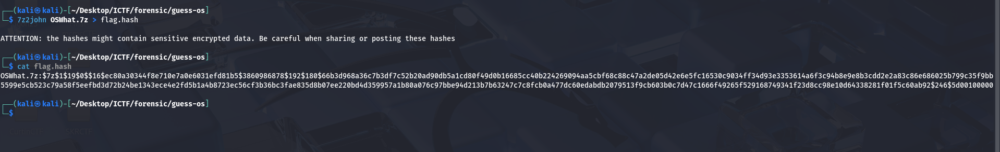
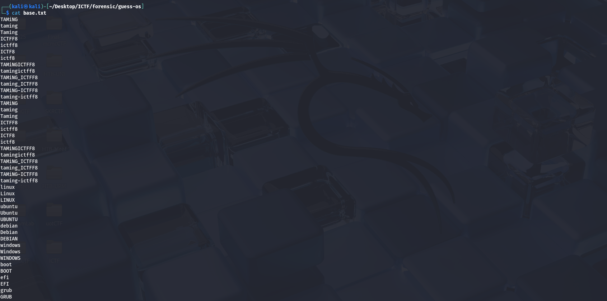
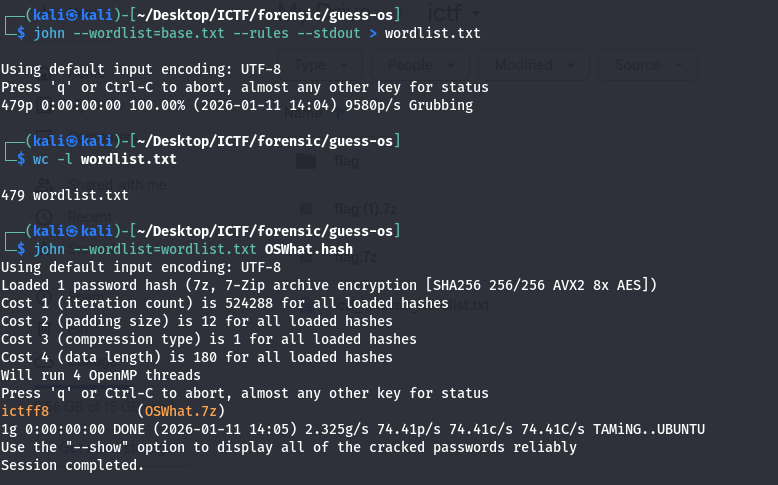
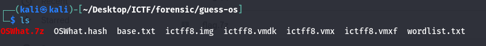
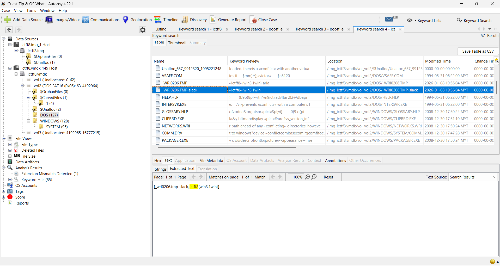

# Writeup Taming i-CTFF8

## 📑 Table of Contents

- [Forensics](#forensic)
  - [73 Golongan Manusia Di Akhirat](#73golongan)
  - [Khutbah Jumaat](#khutbah)
  - [Guest Zip & OS What](#Guest-Zip&OS-What)
  - [Help me!](#Help-me!)

### 73 Golongan Manusia Di Akhirat

For this challenge, multiple .txt files were provided.
At first glance, all the files looked exactly the same, containing the same sentence.
Honestly, at the beginning, I had no idea what to do 😅

Since the content looked identical, I suspected there might be a small hidden difference between the files.
So I decided to compare the files using checksums: **`md5sum *`**

After generating the MD5 hashes, I noticed that one file had a different hash:

This confirmed that although the files looked the same, one of them was actually different.

To verify, I compared `41.txt` with a normal file (for example 1.txt).
After checking the contents carefully, I found that this sentence was missing in 41.txt:

`Kesabaran yang disertai iman kepada Allah membawa kemenangan`

At this point, I assumed this sentence was intentionally removed to act as the flag content.

I tried submitting the flag in the expected format…
and LOL, it worked 😆
Pure logic (and maybe a bit of luck).

#### 🚩 Flag: ictff8{Kesabaran yang disertai iman kepada Allah membawa kemenangan}
#

### Khutbah Jumaat

### Guest Zip & OS What

We were given an encrypted 7-Zip archive.
First, I extracted the archive’s password hash using 7z2john so it could be cracked offline with John the Ripper.

This converts the 7z encryption metadata into a crackable hash format.

Next, I tried a wordlist attack using the popular rockyou.txt wordlist.
However, this took a long time and didn’t return any result. I assumed the password was not present in rockyou.txt, which is common in CTF challenges.

Instead of brute-forcing blindly, I generated my own wordlist.
I used keywords such as event names, question name, event venue.

Using the custom wordlist, I ran John again:

This time, the password was cracked successfully.

password: **`ictff8`**

With the password, I extracted the contents of the archive:
1. ictff8.img
2. ictff8.vmdk
3. ictff8.vmx
4. ictff8.vmxf

These files indicate a virtual machine disk.

I opened the disk image using Autopsy and performed keyword searches.
After analyzing the contents, I was able to locate the flag successfully.

#### 🚩 Flag: ictff8{win3.1win}
#

### Help me!
